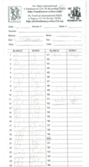
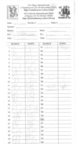
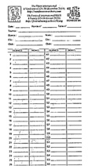
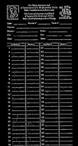

# Chessparse

This code tries to extract the grid of some chess cards on which are reported the moves of the chessplayers.

The python code ends up by identifying the grid lines of the tables where the moves are reported.

It is strongly inspired from a tutorial on using opencv to extract the grid of a sudoku board https://aishack.in/tutorials/sudoku-grabber-opencv-plot/ .

# Examples

## Example 1

    python3 parse.py --output_dir ./examples/chess1 chess1.png

| Original image | Blured | Threshold | Not | 
| :---: | :---: | :---: | :---: |
|  |  |  |  |

## Example 2

    python3 parse.py --output_dir ./examples/chess2 chess2.png

# Note

For resizing the generated images, I used

    find . -type f -name '*.jpg' -execdir bash -c 'convert -resize 25% ${0##*/}  resized-${0##*/}' \{\} \;
